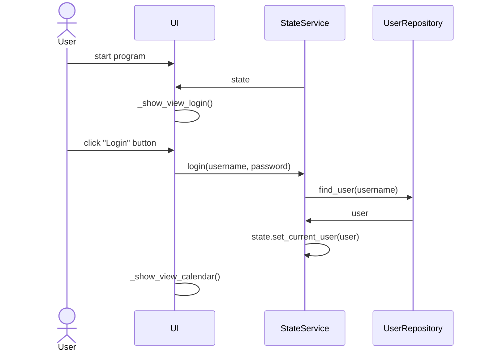

### Package diagram for the program as of 27/11/2023

### Finished program's package diagram (may and probably will change)

### Sequence diagram for user creation

```mermaid
sequenceDiagram
  actor User
  User->>UI: start program
  StateService->>UI: state
  UI->UI: _show_view_login()
  User->>UI: click "Login" button
  UI->>StateService: login(username, password)
  StateService->>UserRepository: find_user(username)
  UserRepository->>StateService: user
  StateService->>StateService: state.set_current_user(user)
  UI->UI: _show_view_calendar()
```
