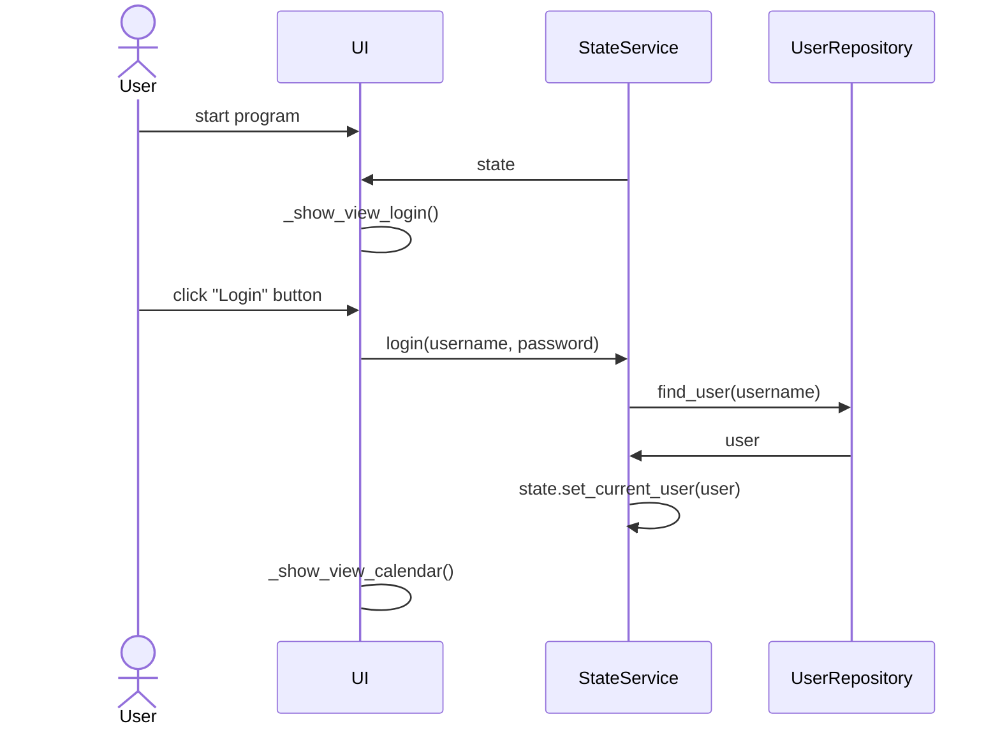

### Structure
The program is separated into four packages called UI, services, repositories and entities. The UI package handles displaying the user interface as well as passing state information between the various views, while the state handling itself is done by the StateService class, which is a part of the services package. The service package handles most of the application logic that isn't related to displaying the user interface, while the repository package handles retrieving from and saving informormation to the database. The entity package contains several classes used in the application.

### User interface
The user interface consists of various views. The first view the user sees when opening the program is the login view, prompting the user to enter a username and a password. There is no separate page or menu for creating accounts; if the user enters a username that doesn't exist in the database yet, an account is created and the user can press login again to log in. The next window displays a calendar (or year) view, which by default shows the calendar for the current year. From here the user has various buttons they can press to view other pages, or they can click one of the days in the calendar to open a date (or day) view, where they can also create, edit and remove notes for any day shown on the calendar. Other views include the help view for information about how to use the application, and configuration view for managing some user-specific settings.

### Application logic
The application mostly deals with users, notes and dates, so there are specific services for handling each type of object. The UserService and NoteService classes mostly use the database through the repository package that deals with the database directly, while the DateService class has some functions for dealing with getting future and past dates based on a particular date. Most of the heavy lifting when it comes to date-related things is achieved by using python's existing datetime, calendar and dateutil modules, and the majority of other application logic is inserting and retrieving users and notes to and from the database based on different criteria.

#### Package diagram

### Major functionality
Below is a sequence diagram describing user creation.

#### Sequence diagram for user creation

### Things to improve
Many parts of the code, especially relating to the user interface, could be improved for better readability. A different approach to the user interface would likely have resulted in less repetition in the code. The configuration system is quite awkward from a programming perspective, as setting, getting and generally dealing with a single config setting currently takes multiple functions. The user interface runs slow. The passwords are stored in plaintext in the database.