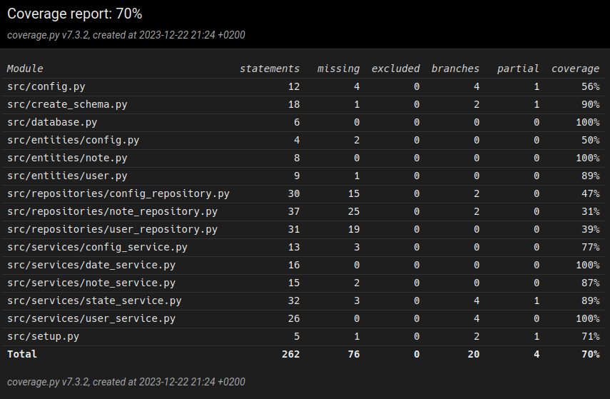

### Test coverage

The test coverage is about 70%. Notably lacking testing are the repository classes. The service classes are individually tested by the (for example) TestDateService for the DateService class, and so on.

### User interface
User interface has been tested manually and is left out of automatic testing.

### Remaining issues
Unusual inputs have not been tested much. An empty username is accepted like any other username when creating a new user or logging in. There are no useful error messages in case of missing files or most other kinds of user error.
