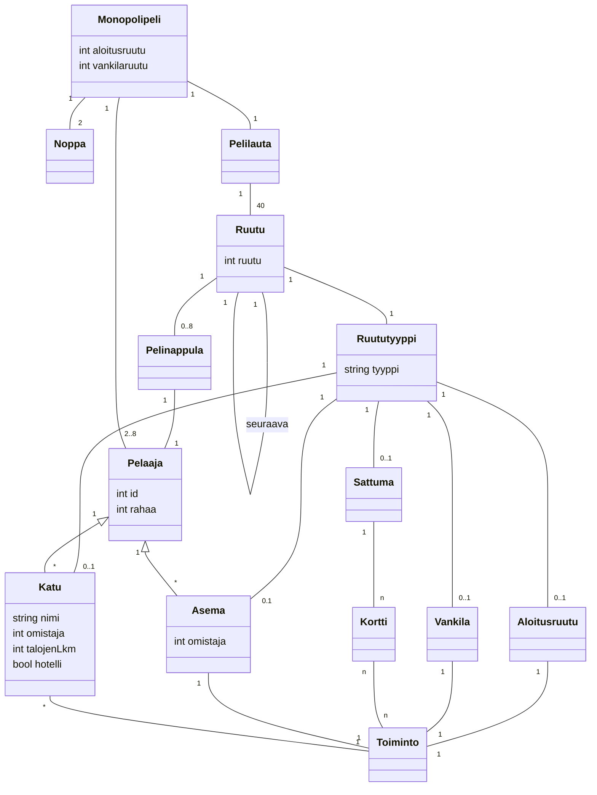

```mermaid
 classDiagram
    Monopolipeli "1" -- "2" Noppa
    Monopolipeli "1" -- "1" Pelilauta
    class Monopolipeli{
      int aloitusruutu
      int vankilaruutu
    }
    Pelilauta "1" -- "40" Ruutu
    Ruutu "1" -- "1" Ruutu : seuraava
    class Ruutu{
      int ruutu
    }
    Ruutu "1" -- "1" Ruututyyppi
    Ruututyyppi "1" -- "0..1" Aloitusruutu
    Ruututyyppi "1" -- "0..1" Vankila
    Ruututyyppi "1" -- "0..1" Sattuma
    Sattuma "1" -- "n" Kortti
    Ruututyyppi "1" -- "0.1" Asema
    class Ruututyyppi{
      string tyyppi
    }
    class Asema{
      int omistaja
    }
    class Katu{
      string nimi
      int omistaja
      int talojenLkm
      bool hotelli
    }
    Ruututyyppi "1" -- "0..1" Katu
    Aloitusruutu "1" -- "1" Toiminto
    Vankila "1" -- "1" Toiminto
    Kortti "n" -- "n" Toiminto
    Asema "1" -- "1" Toiminto
    Katu "*" -- "1" Toiminto
    Ruutu "1" -- "0..8" Pelinappula
    Pelinappula "1" -- "1" Pelaaja
    Pelaaja "2..8" -- "1" Monopolipeli
    class Pelaaja{
      int id
      int rahaa
    }
    Pelaaja "1" <|-- "*" Katu
    Pelaaja "1" <|-- "*" Asema
```